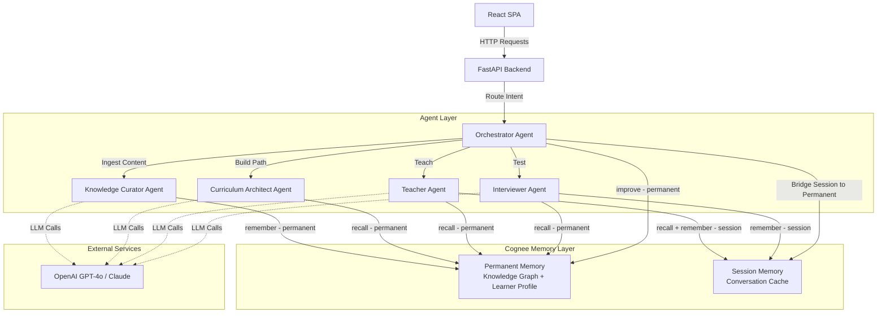

# Design Document: MindForge

## Overview

MindForge is a multi-agent AI tutoring system built on Cognee's memory platform that provides personalized learning through persistent memory. The system orchestrates 5 specialized agents that collaborate to ingest educational content, build learning paths, teach using the Socratic method, and assess knowledge through adaptive interviews.

### Design Philosophy

**Memory-Centric Architecture**: Unlike stateless tutors, MindForge treats memory as a first-class citizen. All interactions flow through Cognee's four core operations (remember, recall, improve, forget), ensuring persistent context across sessions.

**Agent Specialization**: Each agent has a single responsibility—Knowledge Curator handles content ingestion, Curriculum Architect builds learning paths, Teacher conducts Socratic dialogue, Interviewer assesses knowledge, and Orchestrator coordinates workflows. This separation enables parallel development and clear interfaces.

**Dual Memory Model**: The system distinguishes between Session Memory (fast, temporary, scoped to a single session) and Permanent Memory (persistent, cross-session, graph-structured). Session memory enables fluid conversations while permanent memory ensures long-term learning continuity.

**Feedback-Driven Personalization**: Every learner interaction generates feedback that enriches the knowledge graph. Incorrect answers strengthen prerequisite links; correct answers unlock advanced concepts. The system continuously improves its teaching strategy through Cognee's improve() API.

### Key Design Decisions

1. **FastAPI Backend + React Frontend**: FastAPI provides async request handling and OpenAPI docs. The frontend is a React SPA using shadcn/ui + Tailwind CSS + Framer Motion for a polished, interactive experience.

2. **LLM-Based Agent Reasoning**: Each agent uses GPT-4o or Claude for context-aware decision making. System prompts define agent behaviors while Cognee provides the memory layer.

3. **Knowledge Graph as DAG**: Concepts form a directed acyclic graph where edges represent prerequisite relationships. This enables topological sorting for optimal learning paths.

4. **Dataset Scoping**: Each topic domain (e.g., "Deep Learning") becomes a Cognee dataset, enabling efficient filtering and multi-topic support in future iterations.

5. **Graceful Degradation**: All Cognee API calls implement retry logic with exponential backoff. Fallback responses ensure the learner experience continues even during transient failures.

## Architecture

### System Architecture Diagram



### Component Layers

**1. Presentation Layer (React SPA)**
- Animated chat interface for Teacher Mode with typewriter streaming
- Interactive quiz interface for Interviewer Mode with live feedback
- Progress dashboard with concept graph visualization and mastery charts
- Responsive layout with dark/light mode, built on shadcn/ui + Tailwind CSS + Framer Motion

**2. API Layer (FastAPI)**
- RESTful endpoints for all operations
- Request validation and authentication
- WebSocket support for real-time chat (future enhancement)
- OpenAPI documentation at `/docs`

**3. Agent Layer**
- 5 specialized agents with single responsibilities
- LLM-based reasoning for context-aware decisions
- Structured message passing via Orchestrator
- Stateless agent design (state lives in Cognee)

**4. Memory Layer (Cognee)**
- **Permanent Memory**: Knowledge graph, learner profiles, concept relationships
- **Session Memory**: Conversation history, interim test results
- **Dataset Scoping**: Isolate topics for efficient querying
- **Auto-routing**: Cognee optimizes retrieval strategies based on query type

**5. External Services**
- **LLM Provider**: OpenAI GPT-4o or Anthropic Claude for agent reasoning
- **Cognee Cloud/Local**: Self-hosted or cloud-managed memory platform

### Data Flow Patterns

**Pattern 1: Content Ingestion**
```text
User uploads paper → API → Orchestrator → Knowledge Curator
  → cognee.remember(text, dataset="deep_learning")
  → Extract concepts & relationships → Store in Knowledge Graph
```

**Pattern 2: Learning Path Generation**
```text
User requests topic → API → Orchestrator → Curriculum Architect
  → cognee.recall(query="concepts for deep_learning", dataset="deep_learning")
  → Retrieve concept graph → Topological sort → Filter by learner progress
  → Return ordered Learning Path
```

**Pattern 3: Socratic Teaching Session**
```text
User enters Teacher Mode → API → Orchestrator → Teacher Agent
  → cognee.recall(query="next concept for learner_123")
  → LLM generates explanation + question
  → User responds → cognee.remember(interaction, session_id="sess_456")
  → Evaluate response → Continue or advance
  → End session → Orchestrator.improve(session_ids=["sess_456"])
```

**Pattern 4: Adaptive Interview**
```text
User enters Interviewer Mode → API → Orchestrator → Interviewer Agent
  → cognee.recall(query="weak concepts for learner_123")
  → Generate questions targeting weaknesses
  → User answers → cognee.remember(result, session_id="sess_789")
  → Calculate score → Update feedback weights
  → End session → Orchestrator.improve(session_ids=["sess_789"])
```

**Pattern 5: Session → Permanent Memory Bridge**
```text
Session completes → Orchestrator calls cognee.improve(session_ids=[...])
  → Cognee enriches Learner Profile with performance data
  → Updates feedback weights in Knowledge Graph
  → Future recall() queries reflect updated priorities
```


## Cognee Integration

### Cognee API Overview

Cognee provides 4 core operations that replace traditional add/cognify/search patterns:

1. **`cognee.remember()`** - Store content in memory (permanent or session-scoped)
2. **`cognee.recall()`** - Query memory with auto-routing optimization
3. **`cognee.improve()`** - Enrich memory with feedback and bridge session→permanent
4. **`cognee.forget()`** - Remove content, datasets, or entire user memory

### remember() - Content Storage

**Purpose**: Ingest educational content, store interactions, record test results.

**API Signature**:
```python
await cognee.remember(
    data: str | List[str] | DataItem,
    dataset: Optional[str] = None,
    session_id: Optional[str] = None,
    self_improvement: bool = True
)
```

**Parameters**:
- `data`: Raw text, file path, list of files, or DataItem objects
- `dataset`: Scoped collection for organizing related content (e.g., "deep_learning")
- `session_id`: For session-scoped memory (fast cache, temporary storage)
- `self_improvement`: If True, automatically runs improve() after storage

**MindForge Usage Examples**:

```python
# 1. Knowledge Curator: Store educational content in permanent memory
await cognee.remember(
    data=paper_text,
    dataset="deep_learning",
    self_improvement=True  # Auto-enrich knowledge graph
)

# 2. Teacher Agent: Store dialogue in session memory
await cognee.remember(
    data={
        "learner_id": "learner_123",
        "concept": "backpropagation",
        "question": "What is the chain rule in backpropagation?",
        "answer": "It's how gradients flow backward through layers",
        "evaluation": "correct",
        "timestamp": "2025-01-15T10:30:00Z"
    },
    session_id="sess_456",
    self_improvement=False  # Don't persist yet, batch at session end
)

# 3. Interviewer Agent: Store test results
await cognee.remember(
    data={
        "learner_id": "learner_123",
        "concept": "gradient_descent",
        "question_id": "q_789",
        "correct": False,
        "difficulty": "medium",
        "timestamp": "2025-01-15T10:45:00Z"
    },
    session_id="sess_456"
)
```

**Storage Strategy**:
- **Permanent Memory**: Educational content, concept definitions, prerequisite relationships, learner profiles
- **Session Memory**: Conversation history, interim test answers, transient UI state
- **Dataset Scoping**: One dataset per topic domain for efficient filtering


### recall() - Memory Retrieval

**Purpose**: Query knowledge graph, retrieve learner progress, fetch concept definitions.

**API Signature**:
```python
results = await cognee.recall(
    query_text: str,
    dataset: Optional[str] = None,
    session_id: Optional[str] = None,
    limit: int = 10
)
```

**Parameters**:
- `query_text`: Natural language query or structured search
- `dataset`: Filter results to specific topic domain
- `session_id`: Include session memory in results
- `limit`: Maximum number of results

**Auto-Routing**: Cognee automatically optimizes retrieval strategy based on query type (vector search, graph traversal, relational lookup).

**MindForge Usage Examples**:

```python
# 1. Curriculum Architect: Retrieve concept dependencies
concept_graph = await cognee.recall(
    query_text="prerequisite relationships for neural networks",
    dataset="deep_learning",
    limit=50
)

# 2. Teacher Agent: Get next concept for learner
next_concept = await cognee.recall(
    query_text=f"next unmastered concept for learner {learner_id} in learning path",
    dataset="deep_learning",
    limit=1
)

# 3. Teacher Agent: Retrieve session context for continuity
session_history = await cognee.recall(
    query_text="recent dialogue about backpropagation",
    session_id="sess_456",
    limit=5
)

# 4. Interviewer Agent: Find weak concepts to test
weak_concepts = await cognee.recall(
    query_text=f"concepts with negative feedback weights for learner {learner_id}",
    dataset="deep_learning",
    limit=3
)

# 5. Orchestrator: Retrieve learner profile
learner_profile = await cognee.recall(
    query_text=f"learner profile for {learner_id}",
    limit=1
)
```

**Retrieval Strategies**:
- **Graph Traversal**: For prerequisite chains and concept relationships
- **Vector Search**: For semantic similarity (e.g., "concepts similar to gradient descent")
- **Structured Query**: For exact lookups (e.g., learner profile by ID)

### improve() - Memory Enrichment

**Purpose**: Bridge session memory into permanent memory, apply feedback weights, enrich knowledge graph.

**API Signature**:
```python
await cognee.improve(
    dataset: Optional[str] = None,
    session_ids: Optional[List[str]] = None
)
```

**Parameters**:
- `dataset`: Target dataset to enrich
- `session_ids`: List of session IDs to bridge into permanent memory

**When to Call**:
- After teaching session completes (bridge dialogue into learner profile)
- After interview session completes (update concept feedback weights)
- After ingesting new content (if not using self_improvement=True in remember())

**MindForge Usage Examples**:

```python
# 1. Orchestrator: Bridge teaching session into learner profile
await cognee.improve(
    dataset="deep_learning",
    session_ids=["sess_456"]
)
# Result: Conversation history enriches learner profile with:
#   - Concepts discussed
#   - Questions asked and answered
#   - Understanding level indicators

# 2. Orchestrator: Bridge interview results into knowledge graph
await cognee.improve(
    dataset="deep_learning",
    session_ids=["sess_789"]
)
# Result: Test performance updates:
#   - Negative feedback weights for incorrect concepts
#   - Positive feedback weights for correct concepts
#   - Learner profile mastery percentages

# 3. Knowledge Curator: Enrich newly ingested content
await cognee.improve(dataset="deep_learning")
# Result: Extract additional relationships, validate concept links
```

**Improvement Effects**:
- **Learner Profile**: Updated with progress, weaknesses, breakthroughs
- **Concept Weights**: Adjusted based on performance (incorrect → increase weight, correct → decrease weight)
- **Prioritization**: Future recall() queries prioritize weak concepts
- **Session→Permanent**: Ephemeral session data persists across sessions

### forget() - Memory Removal

**Purpose**: Reset learner progress, remove outdated content, delete specific datasets.

**API Signature**:
```python
await cognee.forget(
    data_item: Optional[str] = None,
    dataset: Optional[str] = None,
    everything: bool = False
)
```

**Parameters**:
- `data_item`: Specific item ID to remove
- `dataset`: Remove entire dataset (all content for a topic)
- `everything`: Nuclear option—delete all memory for current user

**MindForge Usage Examples**:

```python
# 1. Orchestrator: Reset learner progress
await cognee.forget(data_item=f"learner_profile_{learner_id}")

# 2. Knowledge Curator: Remove outdated topic
await cognee.forget(dataset="deep_learning")

# 3. Admin: Complete system reset
await cognee.forget(everything=True)

# 4. Orchestrator: Remove specific session (if needed)
await cognee.forget(data_item=f"session_sess_456")
```

**Use Cases**:
- Learner wants to start fresh on a topic
- Content becomes outdated and needs re-ingestion
- User requests data deletion for privacy
- Testing/development environment cleanup

### Memory Management Strategy

**Dataset Organization**:
```text
Dataset: "deep_learning"
├── Concepts: [neural_networks, backpropagation, gradient_descent, ...]
├── Content: [paper_1, paper_2, textbook_chapter_3, ...]
├── Relationships: [prerequisite edges, concept similarities]
└── Learner Profiles: [learner_123_profile, learner_456_profile, ...]

Dataset: "reinforcement_learning"
├── Concepts: [mdp, q_learning, policy_gradient, ...]
└── ...
```

**Session Bridging Workflow**:
1. **Session Start**: Create session_id, store interactions with `remember(session_id=...)`
2. **Session Active**: All agent interactions use same session_id for context continuity
3. **Session End**: Call `improve(session_ids=[...])` to persist learnings
4. **Next Session**: New session_id, but permanent memory reflects previous progress

**Permanent vs Session Memory Decision Tree**:
```text
Is this data needed across sessions?
├─ Yes  → remember(data, dataset="...") [Permanent]
└─ No   → Is this conversational context?
    ├─ Yes  → remember(data, session_id="...") [Session]
    └─ No   → Is this interim test result?
        ├─ Yes  → remember(data, session_id="..."), improve() at end
        └─ No   → Store in application state (not Cognee)
```

## Components and Interfaces

### Agent Specifications

#### 1. Orchestrator Agent

**Responsibility**: Route user intent, coordinate agent workflows, manage session lifecycle.

**Inputs**:
- User request (intent: ingest | learn | teach | test | status | reset)
- Learner ID
- Session context

**Outputs**:
- Routed agent response
- Session state updates
- Error messages

**State Management**: Stateless—session state lives in Cognee session memory.

**API Interface**:
```python
class OrchestratorAgent:
    async def route_request(
        self,
        intent: str,  # "ingest" | "learn" | "teach" | "test" | "status" | "reset"
        learner_id: str,
        session_id: str,
        payload: Dict[str, Any]
    ) -> AgentResponse:
        """Route user intent to appropriate agent."""
        pass
    
    async def start_session(self, learner_id: str) -> str:
        """Create new session, return session_id."""
        pass
    
    async def end_session(self, session_id: str, dataset: str):
        """Bridge session memory to permanent memory."""
        await cognee.improve(dataset=dataset, session_ids=[session_id])
    
    async def get_session_status(self, session_id: str) -> SessionStatus:
        """Retrieve current session state from Cognee."""
        pass
```

**System Prompt**:
```
You are the Orchestrator for MindForge, an AI tutoring system.

Your role:
1. Parse user intent from requests
2. Route to appropriate agent (Knowledge Curator, Curriculum Architect, Teacher, Interviewer)
3. Manage session lifecycle (start, maintain, end)
4. Coordinate multi-agent workflows
5. Handle errors gracefully

Intent classification:
- "ingest": User uploads content → Knowledge Curator
- "learn": User requests learning path → Curriculum Architect
- "teach": User wants Socratic dialogue → Teacher
- "test": User wants assessment → Interviewer
- "status": User checks progress → Query learner profile
- "reset": User wants fresh start → forget() operations

Always maintain learner context across interactions.
```


#### 2. Knowledge Curator Agent

**Responsibility**: Ingest educational content, extract concepts and relationships, build knowledge graph.

**Inputs**:
- Content (PDF, markdown, plain text, URL)
- Dataset name
- Source metadata (author, publication date, title)

**Outputs**:
- Extraction summary (# concepts, # relationships)
- Concept list with definitions
- Knowledge graph structure

**State Management**: Stateless—knowledge graph lives in Cognee permanent memory.

**API Interface**:
```python
class KnowledgeCuratorAgent:
    async def ingest_content(
        self,
        content: str | bytes,
        dataset: str,
        source_metadata: Dict[str, Any]
    ) -> IngestionResult:
        """
        Ingest content into knowledge graph.
        
        Steps:
        1. Extract text from content (handle PDF/markdown/etc)
        2. Use LLM to identify concepts
        3. Use LLM to extract prerequisite relationships
        4. Store in Cognee with remember()
        5. Return summary
        """
        # Extract concepts using LLM
        concepts = await self._extract_concepts(content)
        
        # Extract relationships
        relationships = await self._extract_relationships(concepts)
        
        # Store in Cognee
        await cognee.remember(
            data={
                "content": content,
                "concepts": concepts,
                "relationships": relationships,
                "metadata": source_metadata
            },
            dataset=dataset,
            self_improvement=True
        )
        
        return IngestionResult(
            concepts_count=len(concepts),
            relationships_count=len(relationships),
            concepts=concepts
        )
    
    async def _extract_concepts(self, content: str) -> List[Concept]:
        """Use LLM to identify concepts in content."""
        pass
    
    async def _extract_relationships(self, concepts: List[Concept]) -> List[Relationship]:
        """Use LLM to identify prerequisite relationships."""
        pass
```

**System Prompt**:
```
You are the Knowledge Curator for MindForge.

Your role:
1. Extract educational concepts from research papers, textbooks, and articles
2. Identify prerequisite relationships (A must be learned before B)
3. Preserve source attribution and metadata
4. Build a knowledge graph suitable for learning path generation

Extraction guidelines:
- Identify atomic concepts (single ideas that can be taught independently)
- Extract prerequisite chains (e.g., linear algebra → neural networks → deep learning)
- Preserve LaTeX formatting for mathematical notation
- Include figure captions and diagram descriptions
- Tag concepts with difficulty level (beginner, intermediate, advanced)

Output format:
{
  "concepts": [
    {"id": "concept_1", "name": "Gradient Descent", "definition": "...", "difficulty": "intermediate"},
    ...
  ],
  "relationships": [
    {"from": "concept_1", "to": "concept_2", "type": "prerequisite"},
    ...
  ]
}
```


#### 3. Curriculum Architect Agent

**Responsibility**: Generate personalized learning paths from concept dependencies and learner progress.

**Inputs**:
- Topic/goal (e.g., "Learn Deep Learning")
- Learner ID
- Dataset name

**Outputs**:
- Ordered learning path (topologically sorted concepts)
- Estimated duration
- Progress percentage

**State Management**: Stateless—retrieves from Cognee, computes learning path, returns result.

**API Interface**:
```python
class CurriculumArchitectAgent:
    async def generate_learning_path(
        self,
        goal: str,
        learner_id: str,
        dataset: str
    ) -> LearningPath:
        """
        Generate personalized learning path.
        
        Steps:
        1. Recall concept graph from Cognee
        2. Recall learner profile to identify mastered concepts
        3. Filter out mastered concepts
        4. Topological sort by prerequisites
        5. Prioritize weak concepts (negative feedback weights)
        6. Return ordered path
        """
        # Retrieve concept graph
        concept_graph = await cognee.recall(
            query_text=f"all concepts and prerequisites for {goal}",
            dataset=dataset,
            limit=100
        )
        
        # Retrieve learner profile
        learner_profile = await cognee.recall(
            query_text=f"learner profile for {learner_id}",
            limit=1
        )
        
        # Filter mastered concepts
        remaining_concepts = self._filter_mastered(concept_graph, learner_profile)
        
        # Topological sort
        ordered_path = self._topological_sort(remaining_concepts)
        
        # Prioritize weak concepts
        prioritized_path = self._apply_feedback_weights(ordered_path, learner_profile)
        
        return LearningPath(
            concepts=prioritized_path,
            total_concepts=len(prioritized_path),
            estimated_hours=len(prioritized_path) * 2  # 2 hours per concept estimate
        )
    
    def _topological_sort(self, concepts: List[Concept]) -> List[Concept]:
        """Kahn's algorithm for DAG topological sort."""
        pass
    
    def _apply_feedback_weights(self, concepts: List[Concept], profile: LearnerProfile) -> List[Concept]:
        """Re-order to prioritize weak concepts."""
        pass
```

**System Prompt**:
```
You are the Curriculum Architect for MindForge.

Your role:
1. Generate optimal learning paths based on concept prerequisites
2. Personalize paths based on learner progress and weaknesses
3. Ensure foundational concepts come before advanced topics
4. Adapt to learner performance over time

Path generation rules:
- Prerequisites MUST come before dependent concepts
- Mastered concepts are skipped
- Weak concepts (negative feedback) are prioritized
- Multiple valid orderings → choose pedagogically optimal order
- Estimate 2 hours per concept for time planning

Output format: Ordered list of concepts with metadata
```


#### 4. Teacher Agent

**Responsibility**: Conduct Socratic teaching sessions with small explanations followed by probing questions.

**Inputs**:
- Current concept to teach
- Learner ID
- Session ID
- Previous interaction history (from session memory)

**Outputs**:
- Explanation chunk
- Probing question
- Evaluation of learner response
- Advancement decision (continue or next concept)

**State Management**: Conversational state in session memory; progress updates in permanent memory.

**API Interface**:
```python
class TeacherAgent:
    async def teach_concept(
        self,
        concept_id: str,
        learner_id: str,
        session_id: str,
        dataset: str
    ) -> TeachingResponse:
        """
        Teach concept using Socratic method.
        
        Steps:
        1. Recall concept definition from Cognee
        2. Recall session history for context continuity
        3. Generate explanation chunk + question using LLM
        4. Return to learner
        """
        # Retrieve concept
        concept_data = await cognee.recall(
            query_text=f"concept definition for {concept_id}",
            dataset=dataset,
            limit=1
        )
        
        # Retrieve session context
        session_history = await cognee.recall(
            query_text="recent teaching interactions",
            session_id=session_id,
            limit=5
        )
        
        # Generate Socratic dialogue using LLM
        teaching_content = await self._generate_socratic_dialogue(
            concept_data, session_history
        )
        
        return TeachingResponse(
            explanation=teaching_content.explanation,
            question=teaching_content.question,
            source=concept_data.source
        )
    
    async def evaluate_response(
        self,
        learner_response: str,
        expected_concept: str,
        session_id: str
    ) -> EvaluationResult:
        """
        Evaluate learner's answer and decide next step.
        
        Steps:
        1. Use LLM to assess understanding level
        2. Store interaction in session memory
        3. Decide: continue with follow-up or advance to next concept
        """
        evaluation = await self._llm_evaluate(learner_response, expected_concept)
        
        # Store interaction
        await cognee.remember(
            data={
                "learner_response": learner_response,
                "concept": expected_concept,
                "evaluation": evaluation.score,
                "understanding_level": evaluation.level  # "poor" | "partial" | "good"
            },
            session_id=session_id
        )
        
        return EvaluationResult(
            score=evaluation.score,
            feedback=evaluation.feedback,
            advance=evaluation.level == "good"
        )
```


**System Prompt**:
```
You are the Teacher for MindForge, using the Socratic method.

Your teaching approach:
1. Present information in SMALL chunks (2-3 sentences max)
2. Follow each explanation with a probing question
3. Adapt to learner's understanding level:
   - Poor understanding → Simpler explanation, easier question
   - Partial understanding → Clarification, follow-up question
   - Good understanding → Advance to next concept
4. Build on previous answers (use session context)
5. Always include source attribution

Example interaction:
Teacher: "Backpropagation computes gradients by applying the chain rule backward through a neural network. This allows us to update weights based on error. [Source: Deep Learning Book, Goodfellow et al.]

Question: If a network has 3 layers, in what order does backpropagation compute gradients?"

Learner: "From output to input?"

Teacher: "Correct! Gradients flow backward from the output layer to the input layer. Now, why is this order important for the chain rule?"

Evaluation criteria:
- Correct concept identification → advance
- Partial understanding → clarify and re-ask
- Incorrect → provide hint and simpler question
```

#### 5. Interviewer Agent

**Responsibility**: Assess knowledge through adaptive questioning, track performance, identify weak areas.

**Inputs**:
- Learner ID
- Session ID
- Dataset name
- Concepts to test (optional—if not provided, query for weak concepts)

**Outputs**:
- Generated question
- Answer evaluation
- Performance score
- Updated weakness list

**State Management**: Test results in session memory during interview; performance data bridged to permanent memory at session end.

**API Interface**:
```python
class InterviewerAgent:
    async def start_interview(
        self,
        learner_id: str,
        session_id: str,
        dataset: str,
        num_questions: int = 5
    ) -> InterviewSession:
        """
        Start adaptive interview session.
        
        Steps:
        1. Recall weak concepts from learner profile
        2. Generate questions targeting those concepts
        3. Return first question
        """
        # Find weak concepts
        weak_concepts = await cognee.recall(
            query_text=f"concepts with low mastery for learner {learner_id}",
            dataset=dataset,
            limit=num_questions
        )
        
        # Generate first question
        first_question = await self._generate_question(
            weak_concepts[0], difficulty="medium"
        )
        
        return InterviewSession(
            session_id=session_id,
            total_questions=num_questions,
            current_question=1,
            question=first_question
        )
    
    async def evaluate_answer(
        self,
        question_id: str,
        learner_answer: str,
        correct_answer: str,
        concept_id: str,
        session_id: str
    ) -> AnswerEvaluation:
        """Evaluate answer and adapt difficulty."""
        is_correct = await self._llm_evaluate_answer(learner_answer, correct_answer)
        
        # Store result
        await cognee.remember(
            data={
                "question_id": question_id,
                "concept_id": concept_id,
                "correct": is_correct,
                "learner_answer": learner_answer,
                "timestamp": datetime.utcnow().isoformat()
            },
            session_id=session_id
        )
        
        return AnswerEvaluation(
            correct=is_correct,
            feedback=self._generate_feedback(is_correct, correct_answer),
            next_difficulty="hard" if is_correct else "easy"
        )
    
    async def finish_interview(
        self,
        session_id: str,
        dataset: str
    ) -> InterviewResults:
        """Calculate final score and return results."""
        # Retrieve all answers from session
        session_data = await cognee.recall(
            query_text="all interview answers",
            session_id=session_id,
            limit=100
        )
        
        score = self._calculate_score(session_data)
        
        return InterviewResults(
            score=score,
            total_questions=len(session_data),
            correct_count=sum(1 for d in session_data if d.correct),
            weak_concepts=[d.concept_id for d in session_data if not d.correct]
        )
```


**System Prompt**:
```
You are the Interviewer for MindForge, conducting adaptive knowledge assessments.

Your interview approach:
1. Target weak concepts first, but not only weak concepts(concepts with low mastery or recent failures). Mix them with subtly sometimes
2. Adapt difficulty based on performance:
   - Correct answer → Increase difficulty for that concept
   - Incorrect answer → Decrease difficulty, mark for reinforcement
3. Provide immediate, constructive feedback
4. Generate varied question types (multiple choice, short answer, application)
5. Calculate performance scores accurately

Question difficulty levels:
- Easy: Recall-based (definitions, basic facts)
- Medium: Application-based (solve simple problems)
- Hard: Synthesis-based (combine multiple concepts)

Feedback guidelines:
- Correct: Reinforce with "Correct! [explanation of why]"
- Incorrect: "Not quite. [hint]. The correct answer is [answer]."
- Always connect back to concept definition

Scoring:
- Weight harder questions more than easier questions
- Track per-concept mastery percentage
- Identify consistent weak areas
```

### Message Payloads Between Agents

**Agent Request/Response Protocol**:

```python
@dataclass
class AgentRequest:
    intent: str  # "ingest" | "learn" | "teach" | "test"
    learner_id: str
    session_id: str
    dataset: str
    payload: Dict[str, Any]
    timestamp: str

@dataclass
class AgentResponse:
    status: str  # "success" | "error" | "pending"
    data: Dict[str, Any]
    errors: Optional[List[str]]
    agent_id: str
    timestamp: str
```


**Example Message Flows**:

```python
# 1. Content Ingestion Flow
orchestrator_request = AgentRequest(
    intent="ingest",
    learner_id="learner_123",
    session_id="sess_001",
    dataset="deep_learning",
    payload={
        "content": "<paper text>",
        "metadata": {
            "title": "Attention Is All You Need",
            "authors": ["Vaswani et al."],
            "year": 2017
        }
    },
    timestamp="2025-01-15T10:00:00Z"
)

curator_response = AgentResponse(
    status="success",
    data={
        "concepts_extracted": 12,
        "relationships_extracted": 18,
        "concepts": ["attention_mechanism", "transformer", "self_attention", ...]
    },
    errors=None,
    agent_id="knowledge_curator",
    timestamp="2025-01-15T10:00:45Z"
)

# 2. Learning Path Generation Flow
orchestrator_request = AgentRequest(
    intent="learn",
    learner_id="learner_123",
    session_id="sess_002",
    dataset="deep_learning",
    payload={"goal": "Learn Transformers"},
    timestamp="2025-01-15T10:05:00Z"
)

architect_response = AgentResponse(
    status="success",
    data={
        "learning_path": [
            {"concept_id": "neural_networks", "name": "Neural Networks", "order": 1},
            {"concept_id": "attention_mechanism", "name": "Attention", "order": 2},
            {"concept_id": "transformer", "name": "Transformer Architecture", "order": 3}
        ],
        "total_concepts": 3,
        "estimated_hours": 6
    },
    errors=None,
    agent_id="curriculum_architect",
    timestamp="2025-01-15T10:05:10Z"
)
```


## Data Models

### Knowledge Graph Schema

**Concept Node**:
```python
@dataclass
class Concept:
    id: str  # UUID or slug (e.g., "gradient_descent")
    name: str  # Human-readable name
    definition: str  # LLM-extracted definition
    difficulty: str  # "beginner" | "intermediate" | "advanced"
    source: str  # Paper/book reference
    source_url: Optional[str]
    created_at: str  # ISO timestamp
    
    # Computed/enriched fields
    feedback_weight: float = 0.0  # Positive for mastered, negative for weak
    mastery_percentage: float = 0.0  # Per-learner, computed from interactions

@dataclass
class Relationship:
    from_concept_id: str
    to_concept_id: str
    type: str  # "prerequisite" | "related" | "extends"
    strength: float = 1.0  # Relationship weight (0-1)
```

**Knowledge Graph Structure**:
```
Graph = {
    "nodes": [Concept, Concept, ...],
    "edges": [Relationship, Relationship, ...]
}

# Stored in Cognee as:
await cognee.remember(
    data={
        "type": "knowledge_graph",
        "nodes": [...],
        "edges": [...]
    },
    dataset="deep_learning"
)
```


### Learner Profile Schema

```python
@dataclass
class LearnerProfile:
    learner_id: str
    name: str
    dataset: str  # Current topic domain
    
    # Progress tracking
    mastered_concepts: List[str]  # Concept IDs
    weak_concepts: List[str]  # Concept IDs with negative feedback
    in_progress_concepts: List[str]
    
    # Performance metrics
    total_sessions: int
    total_questions_answered: int
    correct_answers: int
    overall_score: float  # 0-100
    
    # Per-concept mastery
    concept_mastery: Dict[str, float]  # concept_id → mastery percentage (0-100)
    
    # Feedback weights (applied to concept prioritization)
    feedback_weights: Dict[str, float]  # concept_id → weight (-5 to +5)
    
    # Session history
    session_ids: List[str]
    last_session_at: str  # ISO timestamp
    created_at: str
    updated_at: str

# Stored in Cognee as:
await cognee.remember(
    data={
        "type": "learner_profile",
        "learner_id": "learner_123",
        "name": "Alice",
        "dataset": "deep_learning",
        "mastered_concepts": ["neural_networks", "backpropagation"],
        "weak_concepts": ["gradient_descent"],
        "concept_mastery": {
            "neural_networks": 85.0,
            "backpropagation": 90.0,
            "gradient_descent": 45.0
        },
        "feedback_weights": {
            "gradient_descent": -2.5  # Prioritize this concept
        },
        ...
    },
    dataset="deep_learning"
)
```


### Session Data Schema

```python
@dataclass
class Session:
    session_id: str
    learner_id: str
    dataset: str
    mode: str  # "teach" | "interview"
    status: str  # "active" | "incomplete" | "completed"
    
    # Session context
    current_concept_id: Optional[str]
    concepts_covered: List[str]
    
    # Interaction history (stored in session memory)
    interactions: List[Dict[str, Any]]
    
    # Timestamps
    started_at: str
    ended_at: Optional[str]
    
    # Performance (for interview sessions)
    score: Optional[float]
    questions_answered: int = 0
    correct_answers: int = 0

# Session interactions stored as:
await cognee.remember(
    data={
        "session_id": "sess_456",
        "learner_id": "learner_123",
        "interaction_type": "question",
        "concept_id": "backpropagation",
        "question": "How does the chain rule apply?",
        "answer": "Gradients multiply backward through layers",
        "evaluation": "correct",
        "timestamp": "2025-01-15T10:30:15Z"
    },
    session_id="sess_456"  # Session-scoped memory
)
```

### Learning Path Schema

```python
@dataclass
class LearningPath:
    learner_id: str
    dataset: str
    goal: str  # e.g., "Learn Deep Learning"
    
    # Ordered concept list
    concepts: List[ConceptStep]
    total_concepts: int
    completed_concepts: int
    
    # Estimates
    estimated_hours: float
    progress_percentage: float
    
    created_at: str

@dataclass
class ConceptStep:
    concept_id: str
    name: str
    order: int  # Position in learning path (1-indexed)
    status: str  # "not_started" | "in_progress" | "completed"
    estimated_hours: float = 2.0
```

## React Frontend Architecture

### Tech Stack

| Layer | Library | Purpose |
|---|---|---|
| Framework | React 18 + TypeScript | Component model, hooks, strict mode |
| Build | Vite | Fast HMR dev server, optimized prod builds |
| Styling | Tailwind CSS v3 | Utility-first responsive design |
| Components | shadcn/ui | Accessible, unstyled-core component primitives |
| Animation | Framer Motion | Page transitions, chat bubbles, progress animations |
| State | Zustand | Lightweight global state (session, learner profile, mode) |
| Data fetching | TanStack Query v5 | Server state, caching, background refetch |
| Graph viz | React Flow | Interactive concept dependency DAG |
| Charts | Recharts | Mastery trend lines, session score bar charts |
| Icons | Lucide React | Consistent icon set |
| Routing | React Router v6 | SPA navigation between modes |

### Project Structure

```text
frontend/
├── src/
│   ├── components/
│   │   ├── ui/               # shadcn/ui primitives (Button, Card, Badge, etc.)
│   │   ├── chat/             # ChatBubble, ChatInput, TypingIndicator, SourceBadge
│   │   ├── quiz/             # QuestionCard, AnswerInput, FeedbackOverlay, ScoreRing
│   │   ├── graph/            # ConceptGraph (React Flow), ConceptNode, EdgeTooltip
│   │   ├── dashboard/        # MasteryCard, WeakConceptList, SessionHistoryTable
│   │   └── layout/           # AppShell, Sidebar, ModeToggle, TopBar
│   ├── pages/
│   │   ├── TeacherPage.tsx   # Socratic chat view
│   │   ├── InterviewPage.tsx # Quiz/interview view
│   │   ├── DashboardPage.tsx # Progress & analytics view
│   │   └── IngestPage.tsx    # Content ingestion form
│   ├── store/
│   │   ├── sessionStore.ts   # session_id, learner_id, current mode
│   │   └── profileStore.ts   # learner profile, mastery, weak concepts
│   ├── hooks/
│   │   ├── useTeacher.ts     # TanStack Query mutations for teach/answer endpoints
│   │   ├── useInterview.ts   # TanStack Query mutations for interview endpoints
│   │   └── useProfile.ts     # Profile polling and cache updates
│   ├── lib/
│   │   └── api.ts            # Typed fetch wrapper for FastAPI endpoints
│   └── main.tsx
├── index.html
├── vite.config.ts
└── tailwind.config.ts
```

### Key UI Components

#### Teacher Mode — Socratic Chat
- **ChatBubble**: AI messages stream in with a typewriter effect (character-by-character via `useEffect` + `requestAnimationFrame`); learner messages appear instantly
- **SourceBadge**: Inline pill showing paper title + year beneath each AI explanation, clicking opens a popover with full citation
- **ThinkingIndicator**: Three animated dots shown while awaiting API response (Framer Motion stagger)
- **ConceptProgressBar**: Sticky header showing current concept name + position in learning path (e.g., "3 / 9 — Backpropagation")
- **AdvanceButton**: Appears with a slide-up animation when `advance=true`, lets learner explicitly move to the next concept

#### Interviewer Mode — Adaptive Quiz
- **QuestionCard**: Full-bleed card with question text, difficulty badge (Easy/Medium/Hard with color coding), and concept tag
- **AnswerInput**: Textarea with character count; submit on `Ctrl+Enter`
- **FeedbackOverlay**: Full-screen overlay sliding up from the bottom — green ✓ for correct, red ✗ for incorrect, with the correct answer and explanation. Auto-dismisses after 3 seconds
- **ProgressRing**: Animated SVG ring in the top-right showing questions answered / total
- **ScoreSummaryCard**: End-of-interview card with animated score count-up, concept breakdown table, and "Weak Areas" highlighted in red

#### Progress Dashboard
- **ConceptGraph**: Interactive React Flow canvas showing the full concept DAG. Nodes are color-coded by mastery (green = mastered, yellow = in progress, red = weak, grey = not started). Clicking a node opens a side drawer with concept details and history
- **MasteryTrendChart**: Recharts line chart showing overall mastery % over sessions
- **WeakConceptList**: Sorted list of weak concepts with their feedback weight as a progress bar; clicking one triggers a "Practice this concept" shortcut
- **SessionHistoryTable**: Table of past sessions with date, mode, duration, score, and concepts covered

#### Global Layout
- **Sidebar**: Collapsible left nav with mode icons (Book = Teach, Lightning = Interview, Chart = Dashboard, Upload = Ingest). Active mode highlighted with animated indicator
- **ModeToggle**: Prominent toggle in the top bar for quick Teacher ↔ Interviewer switching, with smooth page transition animation
- **TopBar**: Shows learner name, overall mastery %, current topic, and a "Reset Progress" danger button
- **DarkMode**: System-preference default, toggle persisted to `localStorage`

### API Integration

All API calls go through a typed wrapper in `lib/api.ts`:

```typescript
const API_BASE = import.meta.env.VITE_API_URL ?? "http://localhost:8000";

async function apiFetch<T>(path: string, init?: RequestInit): Promise<T> {
  const res = await fetch(`${API_BASE}${path}`, {
    headers: { "Content-Type": "application/json", ...init?.headers },
    ...init,
  });
  if (!res.ok) {
    const err = await res.json();
    throw new Error(err.message ?? "Request failed");
  }
  return res.json() as Promise<T>;
}

// Typed endpoint helpers
export const api = {
  startSession: (learnerId: string) =>
    apiFetch<{ session_id: string }>("/api/v1/session/start", {
      method: "POST", body: JSON.stringify({ learner_id: learnerId }),
    }),
  teachConcept: (payload: TeachRequest) =>
    apiFetch<TeachingResponse>("/api/v1/teach", { method: "POST", body: JSON.stringify(payload) }),
  submitAnswer: (payload: AnswerRequest) =>
    apiFetch<EvaluationResult>("/api/v1/teach/answer", { method: "POST", body: JSON.stringify(payload) }),
  startInterview: (payload: InterviewStartRequest) =>
    apiFetch<InterviewSession>("/api/v1/interview/start", { method: "POST", body: JSON.stringify(payload) }),
  submitInterviewAnswer: (payload: InterviewAnswerRequest) =>
    apiFetch<AnswerEvaluation>("/api/v1/interview/answer", { method: "POST", body: JSON.stringify(payload) }),
  finishInterview: (sessionId: string, dataset: string) =>
    apiFetch<InterviewResults>("/api/v1/interview/finish", { method: "POST", body: JSON.stringify({ session_id: sessionId, dataset }) }),
  getLearningPath: (payload: LearningPathRequest) =>
    apiFetch<LearningPath>("/api/v1/learning-path", { method: "POST", body: JSON.stringify(payload) }),
  ingestContent: (payload: IngestRequest) =>
    apiFetch<IngestionResult>("/api/v1/ingest", { method: "POST", body: JSON.stringify(payload) }),
  resetLearner: (learnerId: string) =>
    apiFetch<void>(`/api/v1/learner/${learnerId}/reset`, { method: "DELETE" }),
};
```

### WebSocket Streaming (Stretch Goal)

For even smoother typewriter effect, the FastAPI backend can expose a `/ws/teach` WebSocket endpoint that streams LLM tokens in real-time. The React frontend connects via `useWebSocket` hook and appends tokens to the chat bubble as they arrive, eliminating the fake typewriter delay.

## Correctness Properties

These properties define observable invariants the system must satisfy at all times. They are expressed as testable assertions that can be validated via property-based testing.

### Property 1: Session Isolation
**Validates: Requirements 13.2, 13.3**
**Property**: Two concurrent sessions for the same learner must not share session-scoped memory.

```python
# Invariant: session memory is keyed by session_id, not learner_id
async def prop_session_isolation(learner_id: str, sess_a: str, sess_b: str):
    await cognee.remember(data={"msg": "session A data"}, session_id=sess_a)
    results_b = await cognee.recall(query_text="session A data", session_id=sess_b)
    assert len(results_b) == 0, "Session B must not see Session A's memory"
```

### Property 2: Permanent Memory Persistence
**Validates: Requirements 6.1, 6.5**
**Property**: Content stored in permanent memory must be retrievable in a subsequent session.

```python
# Invariant: permanent memory survives session boundaries
async def prop_permanent_persistence(concept_text: str, dataset: str):
    await cognee.remember(data=concept_text, dataset=dataset)
    results = await cognee.recall(query_text=concept_text, dataset=dataset)
    assert len(results) > 0, "Permanently stored content must be retrievable"
```

### Property 3: Forget Completeness
**Validates: Requirements 8.1, 8.2, 8.3**
**Property**: After `cognee.forget(dataset=X)`, no recall query against dataset X returns results.

```python
# Invariant: forget removes all associated content
async def prop_forget_completeness(dataset: str):
    await cognee.remember(data="some concept", dataset=dataset)
    await cognee.forget(dataset=dataset)
    results = await cognee.recall(query_text="some concept", dataset=dataset)
    assert len(results) == 0, "Forgotten dataset must return no results"
```

### Property 4: Feedback Weight Monotonicity
**Validates: Requirements 6.3, 6.4, 7.2**
**Property**: Repeated incorrect answers for a concept must monotonically increase its negative feedback weight (i.e., the concept is prioritized more in future sessions).

```python
# Invariant: more failures → higher priority (lower/more-negative weight)
def prop_feedback_monotonicity(profile: LearnerProfile, concept_id: str, n_failures: int):
    weight_before = profile.feedback_weights.get(concept_id, 0.0)
    for _ in range(n_failures):
        profile.apply_feedback(concept_id, correct=False)
    weight_after = profile.feedback_weights[concept_id]
    assert weight_after < weight_before, "Weight must decrease with each failure"
```

### Property 5: Learning Path Topological Validity
**Validates: Requirements 2.4, 3.2, 3.3**
**Property**: In any generated learning path, a concept never appears before one of its prerequisites.

```python
# Invariant: prerequisites always precede dependent concepts
def prop_topological_order(learning_path: LearningPath, relationships: List[Relationship]):
    concept_positions = {step.concept_id: step.order for step in learning_path.concepts}
    for rel in relationships:
        if rel.type == "prerequisite":
            prereq_pos = concept_positions.get(rel.from_concept_id)
            dep_pos = concept_positions.get(rel.to_concept_id)
            if prereq_pos is not None and dep_pos is not None:
                assert prereq_pos < dep_pos, (
                    f"Prerequisite {rel.from_concept_id} must come before {rel.to_concept_id}"
                )
```

### Property 6: Session Bridge Completeness
**Validates: Requirements 6.2, 7.1, 7.5, 13.6**
**Property**: After `cognee.improve(session_ids=[sess_id])`, querying permanent memory must return content that was stored in that session.

```python
# Invariant: improve() bridges session content to permanent memory
async def prop_session_bridge(learner_id: str, session_id: str, dataset: str):
    interaction = {"learner_id": learner_id, "concept": "gradient_descent", "correct": False}
    await cognee.remember(data=interaction, session_id=session_id)
    await cognee.improve(dataset=dataset, session_ids=[session_id])
    results = await cognee.recall(query_text=f"interactions for {learner_id}", dataset=dataset)
    assert len(results) > 0, "Session content must be findable in permanent memory after improve()"
```

### Property 7: Mastered Concept Exclusion
**Validates: Requirements 3.4, 7.4**
**Property**: Concepts marked as mastered in the Learner Profile must not appear in a newly generated learning path.

```python
# Invariant: mastered concepts are filtered from learning paths
def prop_mastered_exclusion(learning_path: LearningPath, learner_profile: LearnerProfile):
    path_concept_ids = {step.concept_id for step in learning_path.concepts}
    mastered_ids = set(learner_profile.mastered_concepts)
    overlap = path_concept_ids & mastered_ids
    assert len(overlap) == 0, f"Mastered concepts must not appear in new path: {overlap}"
```

### Property 8: Score Accuracy
**Validates: Requirements 5.6, 14.2**
**Property**: The interview score must equal `(correct_answers / total_questions) * 100`.

```python
# Invariant: score formula is deterministic and accurate
def prop_score_accuracy(results: InterviewResults):
    expected = (results.correct_count / results.total_questions) * 100
    assert abs(results.score - expected) < 0.01, "Score calculation must be accurate"
```

---

## Error Handling

### Strategy Overview

All external calls (Cognee APIs, LLM provider) follow a **retry with exponential backoff** pattern. Internal agent failures are isolated and surfaced to the Orchestrator, which applies graceful degradation before returning errors to the user.

### Cognee API Failures

```python
import asyncio
from tenacity import retry, stop_after_attempt, wait_exponential

@retry(
    stop=stop_after_attempt(3),
    wait=wait_exponential(multiplier=1, min=1, max=10)
)
async def safe_remember(data, **kwargs):
    """Retry-wrapped cognee.remember() with fallback to local cache."""
    try:
        return await cognee.remember(data=data, **kwargs)
    except Exception as e:
        logger.error(f"cognee.remember() failed: {e}")
        # Cache locally for async retry
        await local_cache.store(data, kwargs)
        raise

@retry(
    stop=stop_after_attempt(3),
    wait=wait_exponential(multiplier=1, min=1, max=10)
)
async def safe_recall(query_text, **kwargs):
    """Retry-wrapped cognee.recall() with empty result fallback."""
    try:
        return await cognee.recall(query_text=query_text, **kwargs)
    except Exception as e:
        logger.error(f"cognee.recall() failed: {e}")
        return []  # Return empty list; agents handle missing context gracefully
```

### Agent-Level Failures

| Failure Scenario | Behavior |
|---|---|
| `recall()` returns empty results | Agent uses LLM-only fallback without graph context |
| LLM call times out (>30s) | Orchestrator returns partial response with error flag |
| `remember()` fails after retries | Interaction cached locally; user notified of sync delay |
| `improve()` fails | Session results not yet bridged; retry scheduled for next session start |
| Agent returns invalid schema | Orchestrator logs error, returns safe error message to user |

### Graceful Degradation: Teacher Agent Example

```python
async def teach_concept_safe(self, concept_id: str, session_id: str, dataset: str):
    try:
        concept_data = await safe_recall(
            query_text=f"definition of {concept_id}",
            dataset=dataset,
            limit=1
        )
    except Exception:
        concept_data = []
    
    if not concept_data:
        # Fallback: ask LLM to generate explanation without graph context
        logger.warning(f"No graph data for {concept_id}, using LLM fallback")
        return await self._llm_fallback_explanation(concept_id)
    
    return await self._generate_socratic_dialogue(concept_data[0], session_id)
```

### API Error Response Format

All FastAPI endpoints return consistent error envelopes:

```python
class ErrorResponse(BaseModel):
    status: str = "error"
    code: str          # e.g., "COGNEE_UNAVAILABLE", "AGENT_TIMEOUT"
    message: str       # Human-readable, safe for user display
    retry_after: Optional[int] = None  # Seconds to wait before retry

# Example: 503 when Cognee is unreachable
{
    "status": "error",
    "code": "COGNEE_UNAVAILABLE",
    "message": "Memory service is temporarily unavailable. Your progress has been saved locally and will sync shortly.",
    "retry_after": 30
}
```

### Local Fallback Cache

When Cognee is unreachable, interactions are queued locally and synced on reconnect:

```python
class LocalFallbackCache:
    """SQLite-backed local cache for offline resilience."""
    
    async def store(self, data: dict, cognee_kwargs: dict):
        """Queue failed Cognee write for later retry."""
        async with aiosqlite.connect("fallback_cache.db") as db:
            await db.execute(
                "INSERT INTO pending_writes (data, kwargs, created_at) VALUES (?, ?, ?)",
                (json.dumps(data), json.dumps(cognee_kwargs), datetime.utcnow().isoformat())
            )
            await db.commit()
    
    async def flush(self):
        """Retry all queued writes against Cognee."""
        async with aiosqlite.connect("fallback_cache.db") as db:
            rows = await db.execute("SELECT id, data, kwargs FROM pending_writes")
            for row in await rows.fetchall():
                await cognee.remember(
                    data=json.loads(row[1]),
                    **json.loads(row[2])
                )
                await db.execute("DELETE FROM pending_writes WHERE id = ?", (row[0],))
            await db.commit()
```

---

## Testing Strategy

### Overview

Testing is organized into four layers:

1. **Unit Tests** — Individual agent logic and data model operations
2. **Integration Tests** — Cognee API interactions using a test environment
3. **Property-Based Tests** — Verify correctness properties from the section above
4. **End-to-End Tests** — Full user flow through Streamlit UI

### Test Structure

```text
tests/
├── unit/
│   ├── test_orchestrator.py
│   ├── test_knowledge_curator.py
│   ├── test_curriculum_architect.py
│   ├── test_teacher_agent.py
│   ├── test_interviewer_agent.py
│   └── test_data_models.py
├── integration/
│   ├── test_cognee_remember.py
│   ├── test_cognee_recall.py
│   ├── test_cognee_improve.py
│   └── test_cognee_forget.py
├── property/
│   ├── test_session_isolation.py
│   ├── test_topological_order.py
│   ├── test_feedback_monotonicity.py
│   └── test_score_accuracy.py
└── e2e/
    ├── test_teacher_mode_flow.py
    └── test_interviewer_mode_flow.py
```

### Property-Based Testing with Hypothesis

```python
from hypothesis import given, strategies as st

# P5: Learning Path Topological Validity
@given(
    concepts=st.lists(st.text(min_size=1), min_size=2, max_size=10, unique=True),
    edges=st.lists(st.tuples(st.integers(), st.integers()), min_size=1)
)
def test_topological_order(concepts, edges):
    """Any valid DAG must produce a topologically ordered learning path."""
    # Build a DAG from random concept names and edge indices
    relationships = [
        Relationship(
            from_concept_id=concepts[a % len(concepts)],
            to_concept_id=concepts[b % len(concepts)],
            type="prerequisite"
        )
        for a, b in edges
        if (a % len(concepts)) != (b % len(concepts))
    ]
    
    # Remove cycles (keep only forward edges in sorted order)
    acyclic_rels = [r for r in relationships if r.from_concept_id < r.to_concept_id]
    
    architect = CurriculumArchitectAgent()
    path = architect._topological_sort(
        [Concept(id=c, name=c, definition="", difficulty="beginner", source="") for c in concepts],
        acyclic_rels
    )
    
    prop_topological_order(LearningPath(concepts=path), acyclic_rels)


# P4: Feedback Weight Monotonicity
@given(n_failures=st.integers(min_value=1, max_value=20))
def test_feedback_monotonicity(n_failures):
    profile = LearnerProfile(
        learner_id="test",
        name="Test",
        dataset="test_ds",
        mastered_concepts=[],
        weak_concepts=[],
        in_progress_concepts=[],
        total_sessions=0,
        total_questions_answered=0,
        correct_answers=0,
        overall_score=0.0,
        concept_mastery={},
        feedback_weights={},
        session_ids=[],
        last_session_at="",
        created_at="",
        updated_at=""
    )
    prop_feedback_monotonicity(profile, "gradient_descent", n_failures)


# P8: Score Accuracy
@given(
    total=st.integers(min_value=1, max_value=50),
    correct=st.integers(min_value=0)
)
def test_score_accuracy(total, correct):
    correct = min(correct, total)
    results = InterviewResults(
        score=(correct / total) * 100,
        total_questions=total,
        correct_count=correct,
        weak_concepts=[]
    )
    prop_score_accuracy(results)
```

### Integration Test Pattern (Cognee)

```python
import pytest
import cognee

@pytest.fixture(autouse=True)
async def clean_cognee():
    """Reset Cognee state before each integration test."""
    yield
    await cognee.forget(everything=True)

@pytest.mark.asyncio
async def test_remember_and_recall():
    """Content stored with remember() must be retrievable via recall()."""
    await cognee.remember(
        data="Gradient descent is an optimization algorithm that minimizes loss.",
        dataset="test_dl"
    )
    results = await cognee.recall(
        query_text="what is gradient descent",
        dataset="test_dl"
    )
    assert len(results) > 0
    assert any("gradient" in str(r).lower() for r in results)

@pytest.mark.asyncio
async def test_session_bridge_via_improve():
    """Interactions in session memory must appear in permanent memory after improve()."""
    session_id = "test_sess_001"
    await cognee.remember(
        data={"concept": "backpropagation", "correct": False},
        session_id=session_id
    )
    await cognee.improve(dataset="test_dl", session_ids=[session_id])
    results = await cognee.recall(
        query_text="backpropagation interactions",
        dataset="test_dl"
    )
    assert len(results) > 0

@pytest.mark.asyncio
async def test_forget_clears_dataset():
    """forget(dataset) must leave no retrievable content."""
    await cognee.remember(data="some content", dataset="temp_ds")
    await cognee.forget(dataset="temp_ds")
    results = await cognee.recall(query_text="some content", dataset="temp_ds")
    assert len(results) == 0
```

### Unit Test Pattern (Agent Logic)

```python
from unittest.mock import AsyncMock, patch

@pytest.mark.asyncio
async def test_curriculum_filters_mastered_concepts():
    """Mastered concepts must not appear in the generated learning path."""
    architect = CurriculumArchitectAgent()
    
    # Mock Cognee recall to return a fixed concept graph
    mock_concepts = [
        Concept(id="neural_nets", name="Neural Networks", ...),
        Concept(id="backprop", name="Backprop", ...),
        Concept(id="transformers", name="Transformers", ...),
    ]
    mock_profile = LearnerProfile(
        mastered_concepts=["neural_nets"],
        ...
    )
    
    with patch("cognee.recall", AsyncMock(side_effect=[mock_concepts, mock_profile])):
        path = await architect.generate_learning_path(
            goal="deep learning", learner_id="l1", dataset="dl"
        )
    
    path_ids = {step.concept_id for step in path.concepts}
    assert "neural_nets" not in path_ids


@pytest.mark.asyncio
async def test_teacher_stores_interaction_in_session():
    """Teacher agent must call remember() with session_id after evaluating a response."""
    teacher = TeacherAgent()
    
    with patch("cognee.remember", AsyncMock()) as mock_remember, \
         patch("cognee.recall", AsyncMock(return_value=[])):
        await teacher.evaluate_response(
            learner_response="It flows backward",
            expected_concept="backpropagation",
            session_id="sess_test"
        )
    
    mock_remember.assert_called_once()
    call_kwargs = mock_remember.call_args.kwargs
    assert call_kwargs.get("session_id") == "sess_test"
```

### E2E Test: Full Teaching Session

```python
@pytest.mark.asyncio
async def test_full_teacher_mode_flow(client: AsyncClient):
    """Simulate a complete teaching session: ingest → learn → teach → improve."""
    
    # 1. Ingest content
    resp = await client.post("/api/v1/ingest", json={
        "content": SAMPLE_PAPER_TEXT,
        "dataset": "test_dl",
        "metadata": {"title": "Test Paper", "year": 2024}
    })
    assert resp.status_code == 200
    
    # 2. Generate learning path
    resp = await client.post("/api/v1/learning-path", json={
        "goal": "Learn Neural Networks",
        "learner_id": "test_learner",
        "dataset": "test_dl"
    })
    assert resp.status_code == 200
    path = resp.json()["learning_path"]
    assert len(path) > 0
    
    # 3. Start teaching session
    resp = await client.post("/api/v1/teach", json={
        "learner_id": "test_learner",
        "concept_id": path[0]["concept_id"],
        "dataset": "test_dl"
    })
    assert resp.status_code == 200
    assert "question" in resp.json()
    
    # 4. Submit answer
    session_id = resp.json()["session_id"]
    resp = await client.post("/api/v1/teach/answer", json={
        "session_id": session_id,
        "answer": "A neural network learns by adjusting weights",
        "concept_id": path[0]["concept_id"]
    })
    assert resp.status_code == 200
    assert resp.json()["evaluation"] in ["correct", "partial", "incorrect"]
    
    # 5. End session (triggers improve())
    resp = await client.post(f"/api/v1/session/{session_id}/end")
    assert resp.status_code == 200
    assert resp.json()["status"] == "completed"
```

### CI Pipeline

```yaml
# .github/workflows/test.yml
name: MindForge Tests
on: [push, pull_request]

jobs:
  test:
    runs-on: ubuntu-latest
    steps:
      - uses: actions/checkout@v3
      - uses: actions/setup-python@v4
        with:
          python-version: "3.11"
      - run: pip install -r requirements-dev.txt
      - name: Unit Tests
        run: pytest tests/unit/ -v --tb=short
      - name: Property-Based Tests
        run: pytest tests/property/ -v --tb=short
      - name: Integration Tests
        env:
          COGNEE_API_KEY: ${{ secrets.COGNEE_API_KEY }}
          OPENAI_API_KEY: ${{ secrets.OPENAI_API_KEY }}
        run: pytest tests/integration/ -v --tb=short
```
